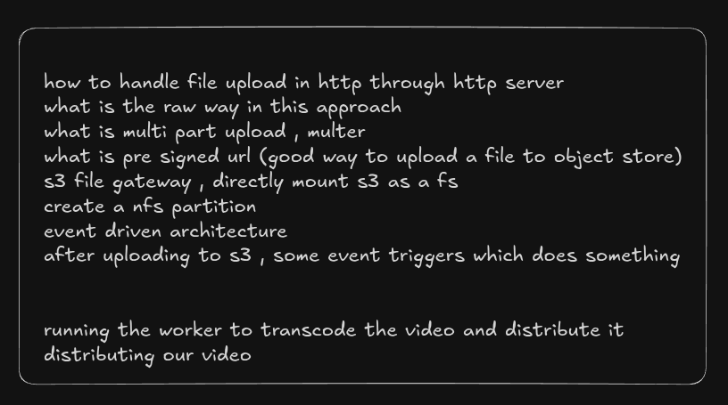
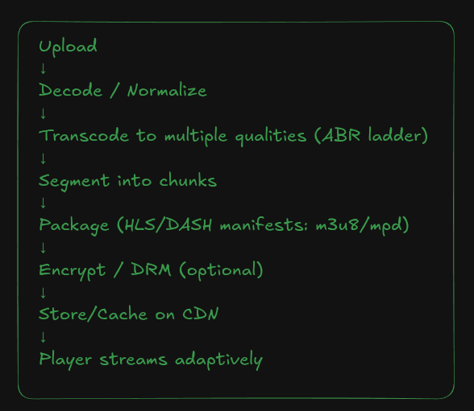
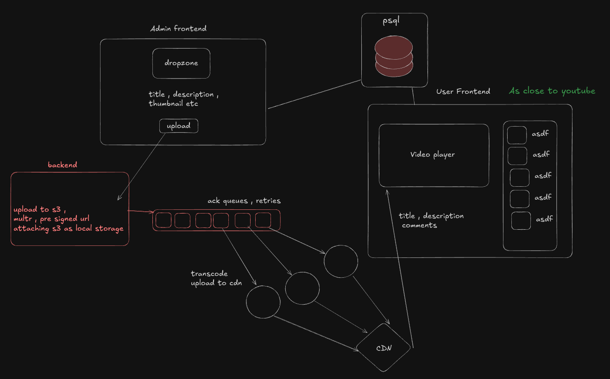

# Ott-platform

This is a project to learn about how ffmpeg can be used to build a good video transcoding with adaptive bitrate . 

## Pre-requisite learning:

## Video Transcoding Pipeline:

## Architecture

